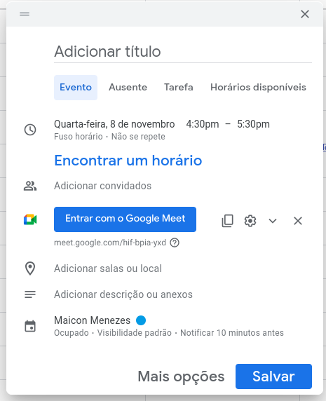
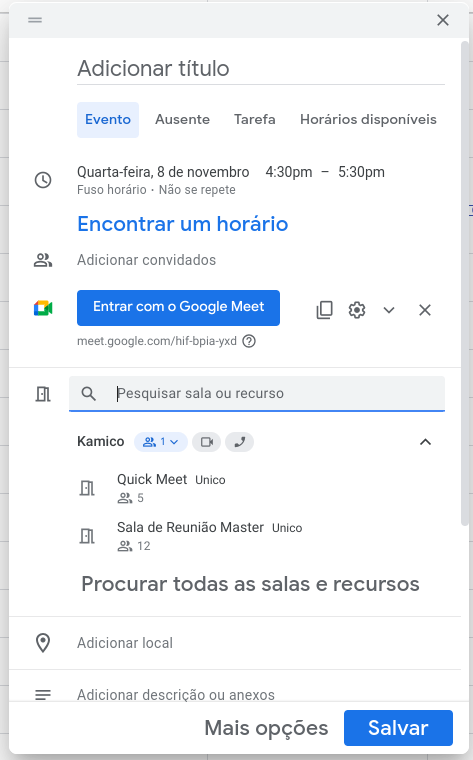
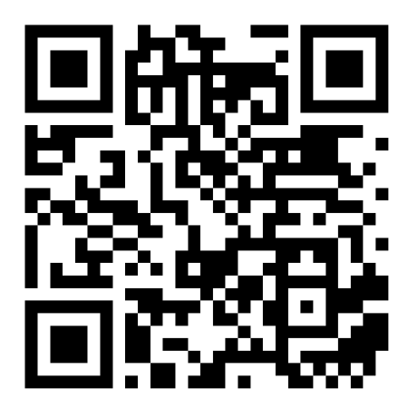

  

## IT Team

### Reserva de Salas

Para reservar uma das salas de reunião no escritório utilizando o Google Agenda, siga os passos a seguir:

1. **Selecionando a Sala**
   - Acesse sua conta do Google e abra o Google Agenda.
   - Clique em "+ Criar" e selecione "Evento".
   

2. **Verificando Disponibilidade**
   - No detalhe do evento, clique em "Adicionar sala".
   - Escolha a sala desejada: Quick Meet ou Sala de Reunião Master.
   

3. **Finalizando a Reserva**
   - Defina a data e o horário do evento.
   - Adicione participantes, se necessário, e salve o evento.
   

*Escaneie o QR Code acima para ser direcionado para a sua agenda e conferir suas reservas.*

---

Para dúvidas ou suporte, entre em contato com IT Team:

- Whatsapp 11 916 654 692 
- E-mail [suporte@kamico.com.br](mailto:suporte@kamico.com.br).

*© KAMI CO. — Tecnologia e eficiência ao seu alcance.*
